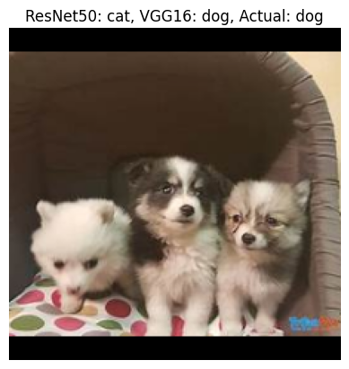
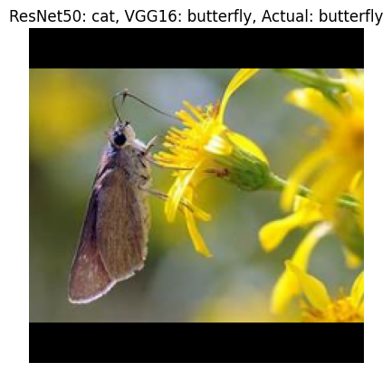

# Animal Classification Project

This project is focused on classifying different species of animals using machine learning techniques. The main file for this project is `animal_classification.ipynb`, which contains all the necessary code and explanations.

## Dataset
The data used in this project was downloaded from [Animals-10](https://www.kaggle.com/datasets/alessiocorrado99/animals10). It contains about 28K medium quality animal images belonging to 10 categories: dog, cat, horse, spyder, butterfly, chicken, sheep, cow, squirrel, elephant.

## Dependencies

To run the notebook, you need to have the following libraries installed:

- numpy
- pandas
- matplotlib
- tqdm
- scikit-learn
- cv2
- keras
- tensorflow

You can install the required libraries using pip

```
pip install numpy pandas matplotlib tqdm scikit-learn opencv-python keras tensorflow
```
## Usage

To use the notebook, follow these steps:

1. Clone the repository:
    ```
    git clone https://github.com/vickCoder7/animal_classification.git
    ```
2. Navigate to the project directory:
    ```
    cd animal_classification
    ```
3. Open the Jupyter Notebook:
    ```
    jupyter notebook animal_classification.ipynb
    ```
4. Run each cell to get the ouputs

## Results

Two models, VGG16 and ResNet50 were used. While the VGG16 performed well and achieved an accuracy of approximately 91%, the ResNet50 model performed poorly and would need further tuning for better results.




